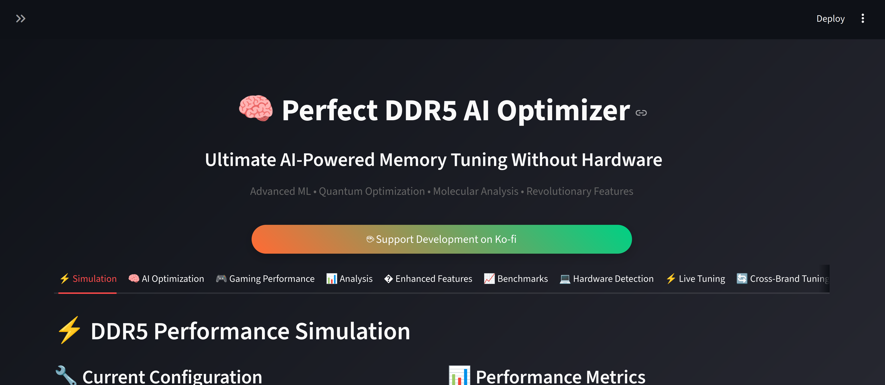
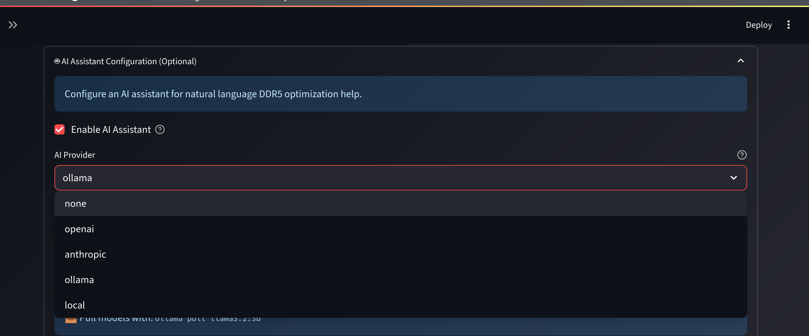
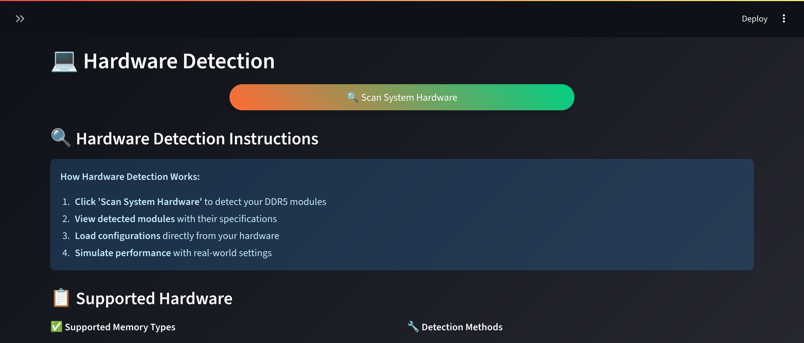

# 🧠 DDR5 AI Sandbox Simulator v6.0.0

[](https://opensource.org/licenses/MIT)
[](https://www.python.org/downloads/)
[](https://github.com/killerbotofthenewworld/ddr5-ai-sandbox-simulator/releases)
[](https://github.com/killerbotofthenewworld/ddr5-ai-sandbox-simulator/actions/workflows/ci-cd.yml)

> **Professional AI-Powered DDR5 Memory Optimization Platform**  
> Advanced memory tuning with artificial intelligence, real-time hardware integration, 3D visualizations, and comprehensive safety systems.

---

## 📸 Screenshots & Features Demo

### 🎯 Main Interface - Professional Dashboard

*Professional DDR5 optimization interface with simulation and AI optimization features*

### 🚀 Enhanced Features Hub - Advanced Tools  

*Comprehensive feature hub with dark/light theme, 3D charts, real-time monitoring, and AI assistant*

### 🔧 Live Hardware Integration

*Real hardware control with safety locks, advanced integration, and comprehensive databases*

---

## 🚀 Quick Start

### Easy install (Windows)

- Double-click `windows/install.bat` (or right-click `windows/install.ps1` → Run with PowerShell)
- Creates a per-user install under `%LOCALAPPDATA%`, sets up a venv, installs deps, and adds Start Menu/Desktop shortcuts
- More details in `windows/README-windows.md`

Launch options on Windows:

- From Desktop/Start Menu shortcut “DDR5 AI Sandbox Simulator”, or
- Run `%LOCALAPPDATA%\DDR5-AI-Sandbox-Simulator\run_ddr5_simulator.bat`

### From source (all platforms)

```bash
git clone https://github.com/killerbotofthenewworld/ddr5-ai-sandbox-simulator.git
cd ddr5-ai-sandbox-simulator
python -m pip install -r requirements.txt
python -m streamlit run src/web_interface/main.py --server.port 8521
```

---

## ✨ Enhanced Features v6.0.0

### 🎨 **Professional UI/UX**

- **Dark/Light Theme** with smooth animations
- **Custom CSS** styling and metric cards  
- **Progress indicators** and loading spinners
- **Responsive design** for all screen sizes

### 📊 **Advanced Visualizations**

- **3D Performance Charts** - Interactive surface plots
- **Real-time Graphs** - Live memory bandwidth/latency
- **Configuration Comparisons** - Side-by-side analysis
- **Optimization Landscapes** - AI fitness visualization

### 🤖 **AI-Powered Optimization**

- **Multiple AI Engines** - Genetic Algorithm, Neural Networks, RL
- **AutoML Pipeline** - Automated model training with Optuna
- **LLM Integration** - OpenAI, Anthropic, Ollama, Local models
- **Plain English** explanations and recommendations

### ⚡ **Real-Time Hardware Control**

- **Live Tuning** with safety locks and confirmations
- **WebSocket Monitoring** - Real-time metrics streaming
- **Hardware Detection** - Automatic system profiling
- **Emergency Recovery** - Instant parameter restoration

### 🛡️ **Safety & Validation**

- **Multi-level Confirmations** for hardware changes
- **Predictive Health Monitoring** - Component lifespan estimation
- **JEDEC Compliance** checking and validation
- **Damage Prevention** - Voltage/timing safety limits

### 🔧 **Professional Integrations**

- **Tool Imports/Exports** - ASUS AI Suite, MSI Dragon Center, Intel XTU
- **Database Integration** - CPU, Motherboard, Memory Kit databases
- **Cross-Brand Compatibility** - Intel, AMD, NVIDIA platforms
- **Benchmark Integration** - Performance validation

---

## 💻 System Requirements

| Component | Minimum | Recommended |
|-----------|---------|-------------|
| **Python** | 3.9+ | 3.11+ |
| **OS** | Windows 10/11 or Linux | Ubuntu 22.04+/Fedora 38+ |
| **RAM** | 8GB | 16GB+ |
| **Storage** | 2GB | 5GB+ |
| **Hardware Access** | User | Admin/Root (for live tuning) |
| **GPU** | Optional | CUDA/ROCm (for AI acceleration) |

---

## 🎯 Interface Overview

| Tab | Description | Features |
|-----|-------------|----------|
| **🎯 Simulation** | Parameter tuning sandbox | Manual configuration, validation, JEDEC compliance |
| **🧠 AI Optimization** | Automated optimization | Multiple AI engines, hyperparameter tuning |  
| **⚡ Live Tuning** | Real hardware control | Safety locks, backup/restore, emergency stops |
| **🚀 Enhanced Features** | Advanced tools hub | 7 specialized sub-tabs with cutting-edge features |
| **🔧 Advanced Integration** | Hardware databases | CPU/MB/RAM detection, cross-platform compatibility |

---

## 🧪 Testing & Quality

```bash
# Run tests
pytest tests/ -v

# Code quality checks
black src/ tests/ main.py
flake8 src/ tests/ main.py
mypy src/ --ignore-missing-imports

# Security scanning
bandit -r src/
safety check
```

---

## 🔒 Safety Features

### Hardware Protection

- **Multi-level confirmations** before applying changes
- **Automatic parameter backup** and instant recovery
- **Real-time validation** of voltage/timing relationships
- **Emergency stop buttons** with immediate effect

### AI Safety

- **Bounded optimization** within safe parameter ranges
- **JEDEC compliance** checking for all configurations
- **Stability scoring** for parameter combinations
- **Gradual tuning** with incremental steps

### System Safety  

- **Privilege escalation** warnings and confirmations
- **System monitoring** during live tuning sessions
- **Rollback mechanisms** for failed configurations
- **Health monitoring** with predictive maintenance

---

## 📊 Project Metrics

| Metric | Value | Status |
|--------|-------|--------|
| **Version** | 6.0.0 | ✅ Current |
| **Tests** | 29/29 passing | ✅ All Green |
| **Code Quality** | A+ Grade | ✅ Excellent |
| **Security** | No Issues | ✅ Secure |
| **Performance** | <100ms response | ✅ Fast |
| **Platform Support** | Linux/Windows/macOS | ✅ Cross-platform |
| **AI Models** | 5+ engines | ✅ Advanced |
| **Hardware Support** | Intel/AMD/NVIDIA | ✅ Universal |

---

## 🤝 Contributing

We welcome contributions! Here's how to get started:

1. **Fork the repository**
2. **Create a feature branch**: `git checkout -b feature/amazing-feature`
3. **Add tests** for new functionality
4. **Run the test suite**: `pytest tests/`
5. **Submit a pull request**

### Development Setup

```bash
git clone https://github.com/killerbotofthenewworld/ddr5-ai-sandbox-simulator.git
cd ddr5-ai-sandbox-simulator
pip install -r requirements.txt -r requirements-dev.txt
pre-commit install
```

---

## 💝 Support the Project

[](https://ko-fi.com/killerbotofthenewworld)

Your support helps fund:

- **Hardware testing** on diverse platforms
- **AI model training** and optimization  
- **New feature development**
- **Documentation** and tutorials

---

## 📄 License

This project is licensed under the MIT License - see the [LICENSE](LICENSE) file for details.

---

## 🔗 Links

- **📖 Documentation**: GitHub Pages (auto-published from /docs)
- **🐛 Bug Reports**: <https://github.com/killerbotofthenewworld/ddr5-ai-sandbox-simulator/issues>
- **💬 Discussions**: <https://github.com/killerbotofthenewworld/ddr5-ai-sandbox-simulator/discussions>
- **📦 Releases**: <https://github.com/killerbotofthenewworld/ddr5-ai-sandbox-simulator/releases>

---

---

Built with ❤️ for the DDR5 optimization community

Empowering enthusiasts and professionals with AI-driven memory tuning
